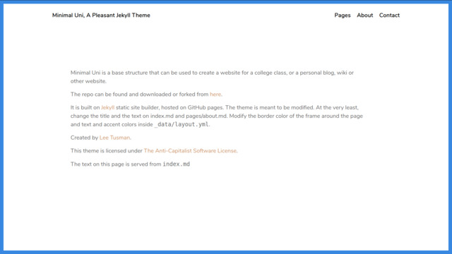

# Minimal Uni 

Live [demo](https://leetusman.com/minimal-uni/)

### A Jekyll Theme for a class website or personal blog or wiki

This is the base Jekyll template for my university courses. Fork this repo or just download and unzip.

This is meant to be an attractive minimal and customizable theme.

It is responsive so it should look nice on phones and tablets as well.

There's probably still a bit of room for improvement in the design. Feel free to make a pull request or open an issue.

  

### Take it for a spin

Run 

```
jekyll serve
```

OR if you will be deploying this to your own custom URL subpage: http://website.com/blog for example, then:

```
jekyll serve --baseurl ''
```

### How to add new posts

I have a navigation link labeled **Pages** in the nav at the top of each page. Clicking that will display all of your blog posts.

You can place blog posts in the ```_posts``` folder. I recommend deleting my own posts and adding your own. Images go in the ```assets/img``` directory. 

The easiest way to get started is to copy one of my posts and then change the title, the front matter at the top and the body content. If you are still running the jekyll serve command above it will rebuild the site. You can then git add and commit your post and when you push it, it will deploy to your website.

Info in the Jekyll documentation on including images and resources can be found [here](https://jekyllrb.com/docs/posts/#including-images-and-resources).

## How to customize

### Change the _config.yml file

Add your site title, description and author name. Just replace the text in this file.

### Change text in the index.md file

This is a markdown file. Change the starter text in there.

Don't touch the front-matter text at the top unless you know what you're doing.

### Change colors, css, etc

This stylesheets are generated using sass. Even if you don't have previous experience using sass preprocessers you should hopefully be able to figure it out by opening up the files and following the format.

Files you may want to change:

```assets/css/2-base/_base.sass```

```assets/css/3-sections/_default.sass```

And possibly other sections to be found in ```assets/css/3-sections```


#### Change the favicon

The favicon is the tiny icon in the browser tab when this site loads. The current favicon is a notebook emoji. You can replace this with another favicon file. You can download emojis as favicons from [here](https://favicon.io/emoji-favicons/).


### Credits

Jekyll is MIT licensed. Plugins are under their own licenses.

My code contributions are under the [The Anti-Capitalist Software License](https://anticapitalist.software/).
